# SAP S/4HANA Extended Business Process Scenario in Kyma
## Description
The main intent of this scenario is to complement an existing business process in an SAP solution – currently SAP S/4HANA with additional business process steps. This involves adding major logic and/or additional data and goes beyond simple UI changes.

This application showcases:

- Building applications on SAP Business Technology Platform (BTP) using [SAP Cloud Application Programming Model(CAP)](https://cap.cloud.sap/docs/)
- Consuming events from SAP S/4HANA on premise using [SAP Event Mesh](https://help.sap.com/viewer/bf82e6b26456494cbdd197057c09979f/Cloud/en-US/df532e8735eb4322b00bfc7e42f84e8d.html)
- Consuming REST APIs from SAP S/4HANA on premise using SAP Business Technology Platform Connectivity Service
- Building and deploying a function in [SAP BTP Kyma Runtime, Serverless](https://kyma-project.io/docs/components/serverless)

## Business Scenario

A business scenario is used to showcase how to build a S/4 HANA on premise extension Application on SAP BTP, Kyma runtime.

John who is an employee of Business Partner Validation Firm iCredible, which is a third-party vendor of ACME Corporation would like to get notifications whenever new Business Partners are added in the S/4HANA backend system of ACME Corporation. John would then be able to review the Business Partner details in his extension app. He would proceed to visit the Business Partner’s registered office and do some background verification. John would then proceed to update/validate the verification details into the extension app. Once the details are verified, the Business Partner gets activated in the S/4HANA system of ACME Corporation.

- Custom extension application that works independently from S/4HANA.

- Changes in S/4 communicated via events in real time to extension application.

- Compute intensive processing available on demand (using serverless).

- Vendor personnel needs access to only custom app

## Architecture

### Solution Diagram

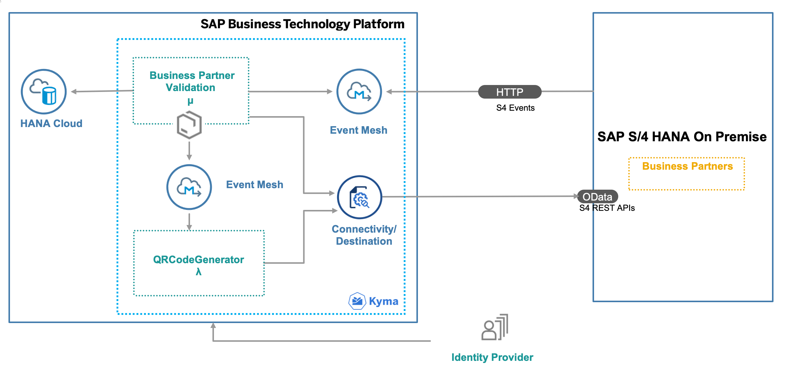

The Business Partner Validation application is developed using the SAP Cloud Application programming Model (CAP) and runs on the SAP BTP,  Kyma runtime. It consumes platform services like SAP Event Mesh, SAP HANA and Connectivity. The events occuring in S/4 HANA on premise are inserted into the Event Mesh queue. The application running in Kyma is notified on events, consumes them from the queue and inserts the event data into the HANA database. The Business Partner Validation Application uses S/4 HANA REST API's to read additional Business Partner Data from the S/4 HANA system. in a next step, the Business Partner Validation App uses an event-driven approach as well by firing events that get consumed by Serverless Function which posts the relevant business partner data to S/4 HANA on premise system using S4HANA oData api's.

## Requirements
* SAP S/4HANA on premise system.
* SAP Business Technology Platform account

### Prerequisites:
* [Node js](https://nodejs.org/en/download/)
* [kubectl command line tool (kubectl)]( https://kubernetes.io/docs/tasks/tools/install-kubectl-windows/)
* [Visual Studio Code](https://cap.cloud.sap/docs/get-started/in-vscode)
* [cds-dk](https://cap.cloud.sap/docs/get-started/)
* [SQLite ](https://sqlite.org/download.html)
* [Docker](https://www.docker.com/products/docker-desktop)
* Refer here for other [tools](https://cap.cloud.sap/docs/guides/deployment/deploy-to-kyma#prerequisites) required

### Entitlements

The application requires below set of SAP Business Technology Platform Entitlements/Quota

| Service                           | Plan       | Number of Instances |
|-----------------------------------|------------|:-------------------:|
| Event Mesh                        | default    |          1          |
| SAP HANA Schemas & HDI Containers | hdi-shared |          1          |
| SAP HANA Cloud                    | hana       |          1          |
| Kyma runtime                      |            |          1          |
| Destination Service               |            |          1          |
| Connectivity Service              |            |          1          |

## Configuration

### Step 1: [S/4HANA Enable OData Service for business partner](https://github.com/SAP-samples/cloud-extension-s4hana-business-process/blob/mission/mission/configure-oData-Service/README.md)

### Step 2: [Setup connectivity between S/4HANA system, SAP BTP](https://github.com/SAP-samples/cloud-extension-s4hana-business-process/blob/mission/mission/cloud-connector/README.md)

### Step 3: Build and deploy the CAP application

#### Kubeconfig setup
1. Download KubeConfig file from SAP BTP cockpit Overview page
2. Right click and copy the file
3. Goto my computer
4. Create folder and name it kubectl
5. Paste the file there, This file is to be replaced when the token is expired
6. Set environment variable for kubectl with the value as path for the folder
7. Set environment variable for KUBECONFIG with the value as path for the pasted config file
8. Execute `kubectl get pods` to test the setup
9. Set the context for your Kyma namespace: 
   
   `kubectl config set-context --current --namespace <your_namespace>`

#### HANA setup
1. [Create an instance of SAP HANA Cloud](https://help.sap.com/viewer/9ae9104a46f74a6583ce5182e7fb20cb/hanacloud/en-US/f7febb16072b41f7ac90abf5ea1d4b86.html)
2. Clone the extension application and navigate to the root folder of the app.

   `git clone <git_url>` 
   
4. Run `./script/db.sh`
5. The script does the below:
   - Creates HDI Service instance with the name caphana
   - Creates a service key corresponding to the hdi service instance
   - Creates a secret in Kyma for the created HDI instance 

#### Steps to deploy the application on kyma runtime

1. Open Makefile and Edit the value for DOCKER_ACCOUNT. 
3. Build the applications and also create and push the docker images to docker account by executing the below script:
   	
      `make push-images`
      
4. Open chart/values.yaml
   - Edit the domain of your cluster, so that the URL of your CAP service can be generated. 
     You can use the pre-configured domain name for your Kyma cluster:
     
     `kubectl get gateway -n kyma-system kyma-gateway -o jsonpath='{.spec.servers[0].hosts[0]}'`
     
   - Create a secret for your Docker repository and and replace the value of 
   
      `imagePullSecret:
       name: <DOCKER_SECRET>`
       
       If its a public repository create an empty secret and add the secret name above.
   - Find all `<DOCKER_ACCOUNT>` and replace all with your docker account/repository
   - Find all `<RELEASE_NAME>` and replace all with your Helm CHart's release name
   - Edit the below for function deployment
   	- replace gitusername with encoderd username
   	- replace gitpassword with encoded password 
   	- replace giturl with url of your git repository 
   	- replace gitbranch with the name of your branch

3. Run the below command to deploy your application

   `helm upgrade --install <RELEASE_NAME> ./chart -n <NAMESPACE>`

### Step 5: [Configure event based communication between S/4HANA and Event Mesh](https://help.sap.com/viewer/810dfd34f2cc4f39aa8d946b5204fd9c/1809.000/en-US/fbb2a5980cb54110a96d381e136e0dd8.html)

## Demo script
   
2. In the kyma console find the URL for the app ` BusinessPartnerValidation-ui` - this is the launch URL for the Business Partner Validation application.

3. Launch the URL in a browser.

4. Click on Business Partner Validation tile

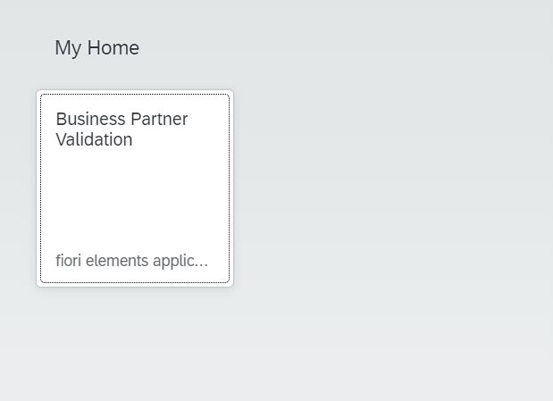

5. The list of BusinessPartners along with their verification status gets displayed. 

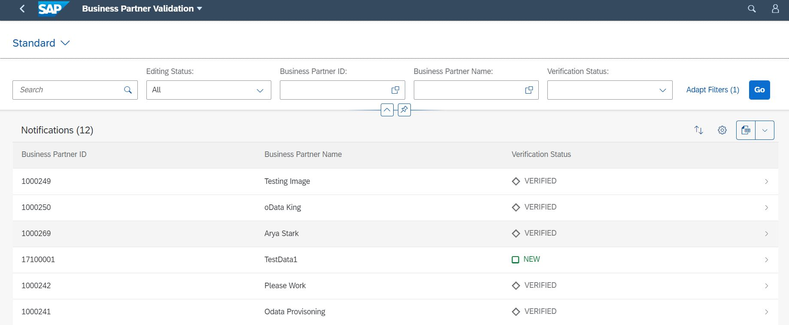

6. Login to the S/4HANA on-premise system

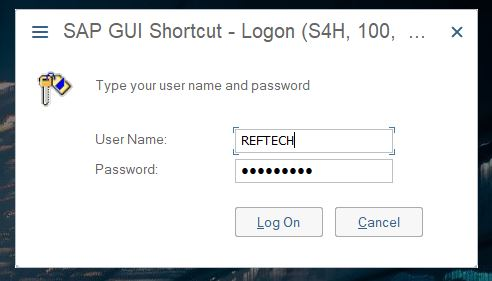

7. Enter transaction code 'bp'

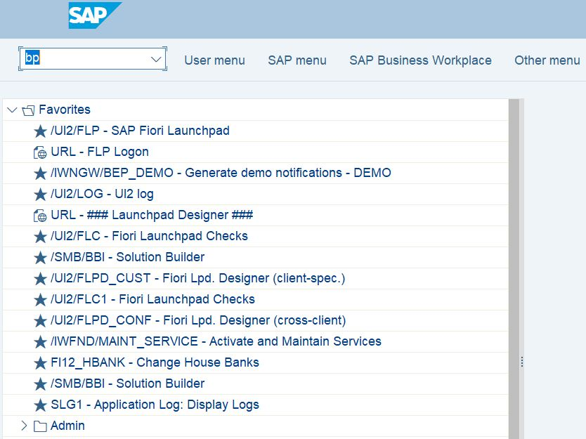

8. Click on Person

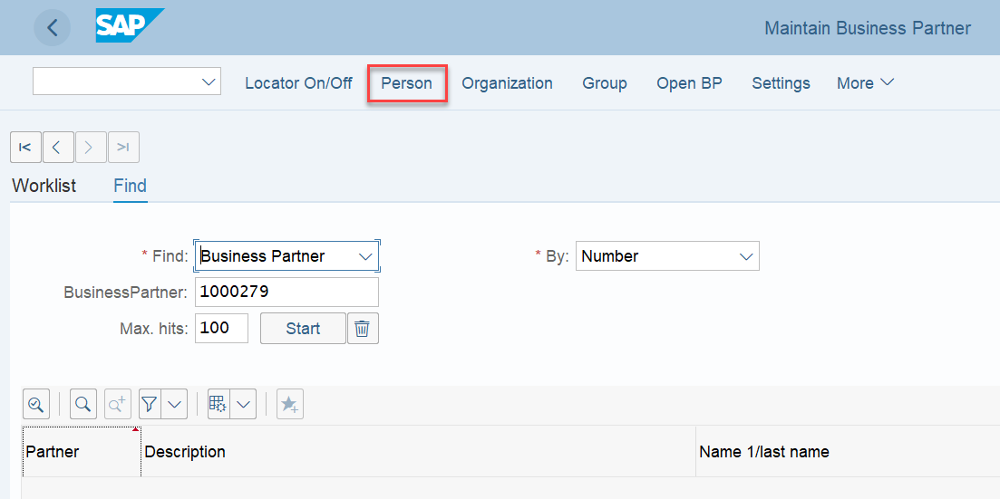

9. Provide first name, last name for the business partner
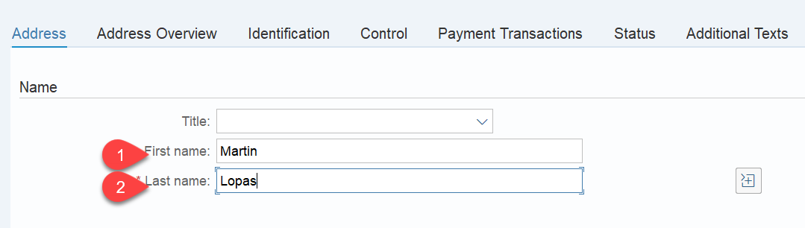

10. Provide the address
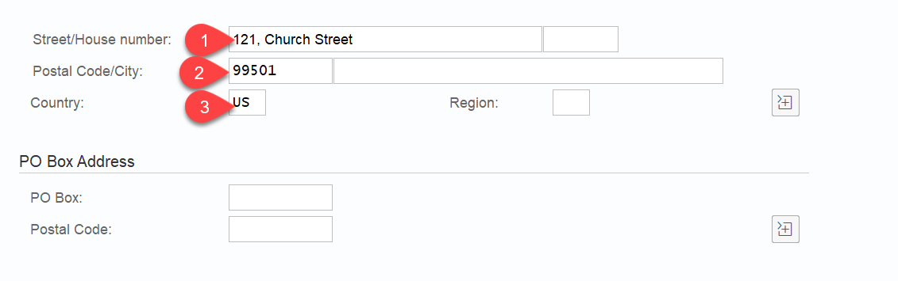

11. Move to the status tab and check mark the 'Central Block' lock. Save the BP. This will create a new Business Partner 

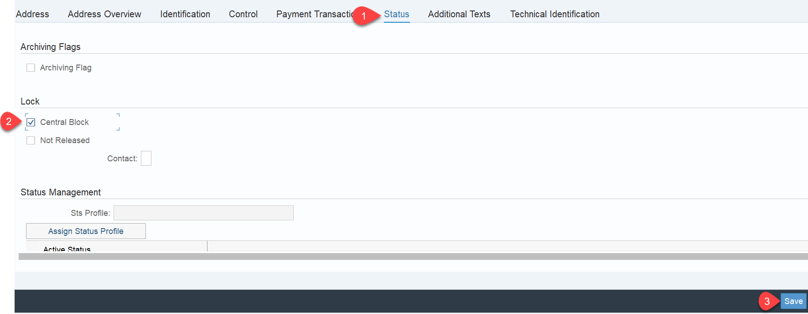

12. Now go back to the BusinessPartnerValidation application to see if the new BusinessPartners has come on the UI

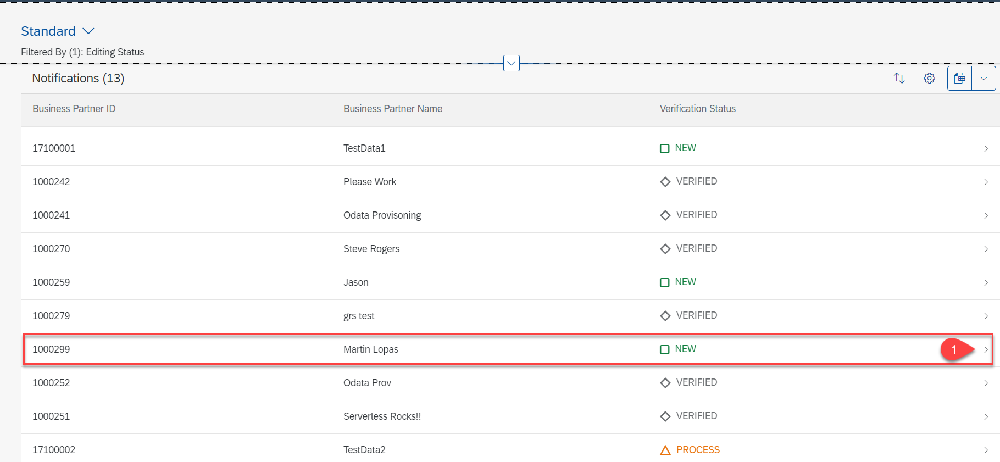

13. Go to the details page for the new BusinessPartner. Click on edit.

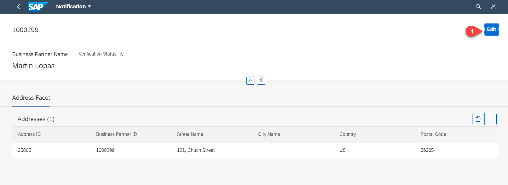

14. Change the Verification Status to VERIFIED. You can also edit the street name, postal code also if needed. Save the data. 

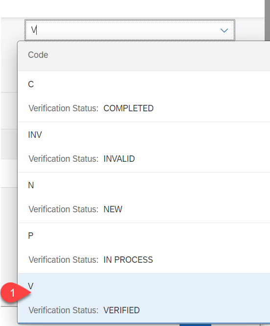

15. Open S/4HANA system, bp transaction. Search for the newly created bp

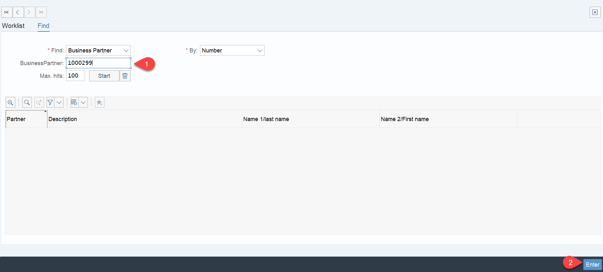

16. Double click on the BP

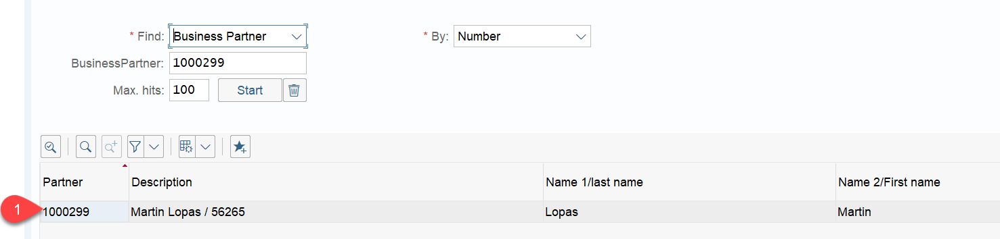

17. You can see that the central Block lock has been removed 

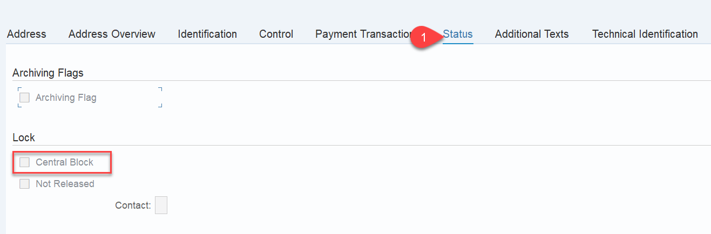

18. The serverless application has also uploaded a QR code for the address details of the BP to the S/4HANA system. 
You can view this by clicking on the icon in the top left corner. You will have to give permission for downloading the image. 

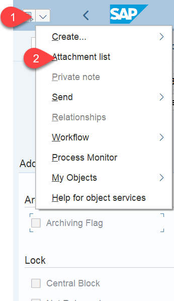

19. You can also notice that in the BusinessPartner Validation UI, the status is now set as COMPLETED.

## Known Issues

No known issues.

## How to Obtain Support

In case you find a bug, or you need additional support, please [open an issue](https://github.com/SAP-samples/cloud-extension-s4hana-business-process/issues/new) here in GitHub.

## License
Copyright (c) 2020 SAP SE or an SAP affiliate company. All rights reserved. This project is licensed under the Apache Software License, version 2.0 except as noted otherwise in the [LICENSE](LICENSES/Apache-2.0.txt) file.
