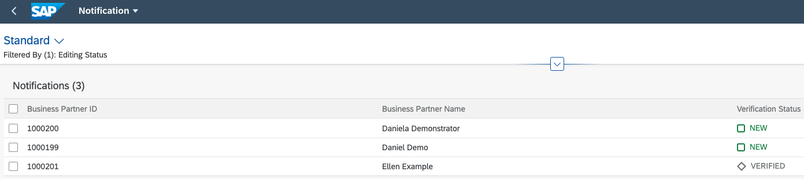
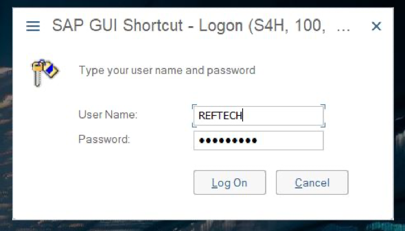
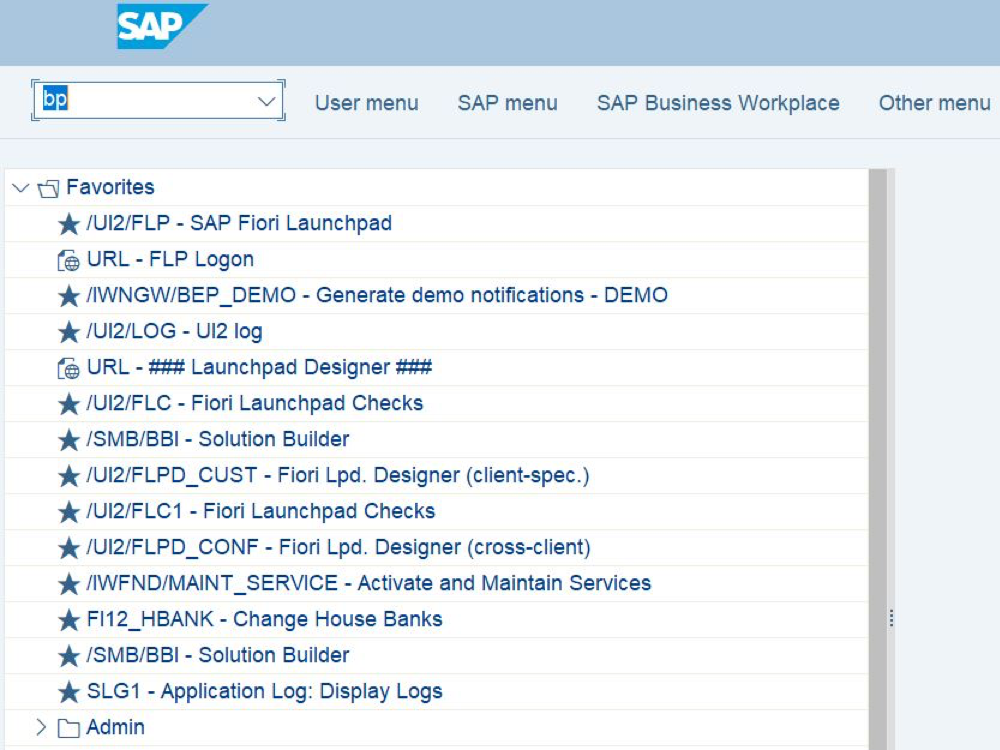
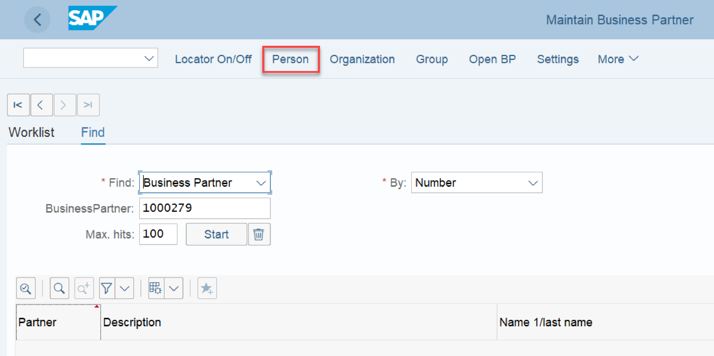
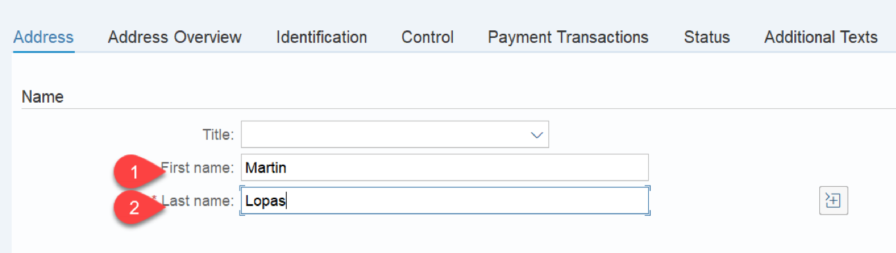
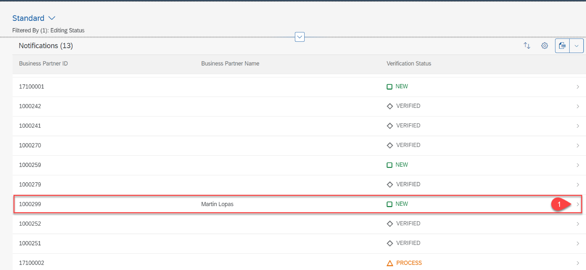
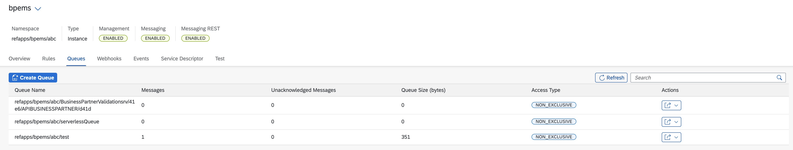
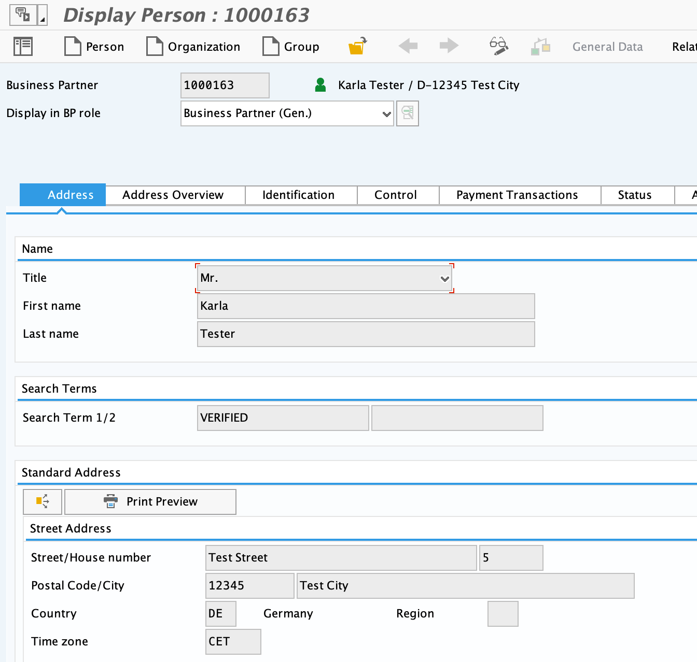

## Test Entire Business Scenario End-To-End
1. Start your Business Partner Validation Application

- Go to *Instances and Subscriptions.*
- Find *Launchpad Service* and click to open the application
- In the Website, Manager find your created Website and click on tile to open
- Click on Business Partner Validation tile
- The list of BusinessPartners along with their verification status gets displayed.

 

2. Log in to your SAP S/4HANA On-prem System

 

3. Enter transaction code *bp*

 

4. Create a new Business Partner

- Click on Person

 

- Provide first name and last name for the business partner

 

- Provide the address

 

 - Move to the status tab and check mark the 'Central Block' lock. Save the BP. It creates a new Business Partner.

 

1. Now, go back to the BusinessPartnerValidation application to see if the new BusinessPartner has appeared as a new entry in the UI.

 

6. Go to the details page for the new BusinessPartner
7. Click on Edit and set the Status to *Verified*

 

8. (Optional) You can configure Event Mesh in a way so that you can see the created Event. For that you could create an additional queue that subscribes to the topic as well.

 

9. Go to your SAP S/4HANA on-premise System.
10. Go to transaction *bp*

 

11. Open the details of the Business Partner you have set to *Verified.*

 

12. Go to the Status tab. You can see that the central Block lock has been removed.

 
