# Configure Your Subaccount in SAP BTP

In this section, you will set up the subaccount in SAP BTP for developing the Easy Franchise application.

**Prerequisite:** You must have an administrator role for SAP BTP.

1. Log in to the SAP BTP cockpit and select your global account.

2. In the **Account Explorer**, choose **Create** &rarr; **Subaccount**.

   

3. In the **Create Subaccount** wizard, enter the following values:

   *  In the **Display Name** field, enter your subaccount name.
   *  In the **Subdomain** field, enter your subdomain ID.
   *  In the **Region** field, select the Cloud Foundry region of your choice: Amazon Web Service, Google Cloud Platform or Microsoft Azure.
   *  In the **Parent** field, select your global account.

      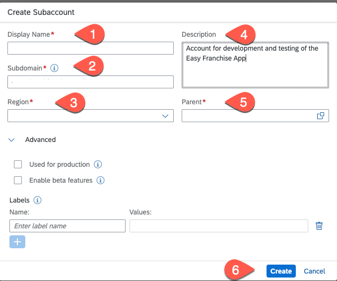

   * For categorizing your subaccount you can add some labels. Choose **Create**.

5. Add entitlements:

   1. Choose **Entitlements** &rarr; **Configure Entitlements** &rarr; **Add Service Plan**.
   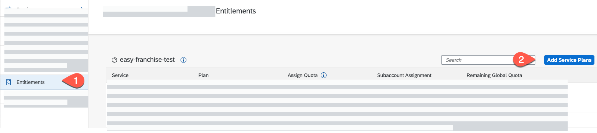

   2. Search for **SAP HANA Cloud** and select the **hana** service plan. For testing only, you can also choose the **hana-free** plan.

   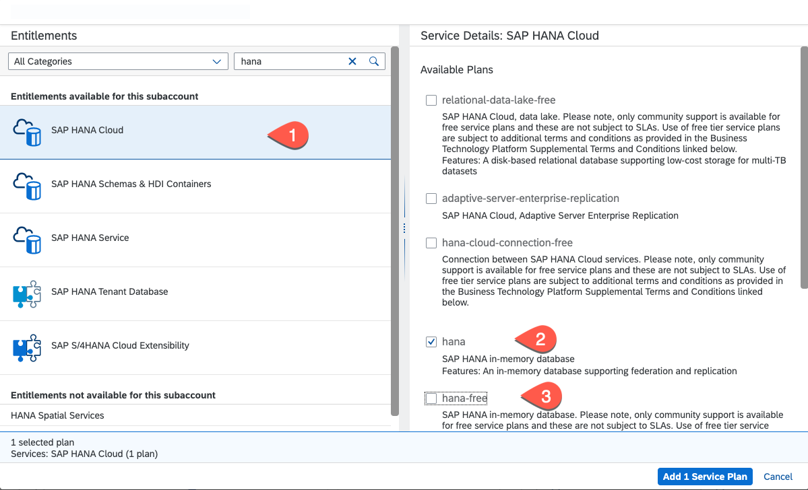

   3. Search for **Cloud Foundry Runtime** and select the **MEMORY** plan.

   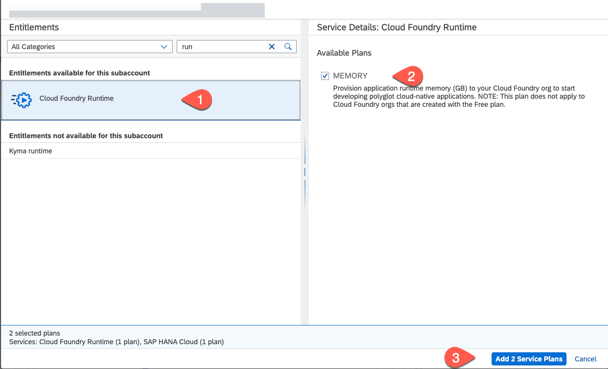

   4. Search for **Kyma Runtime** and select the respective plan.

   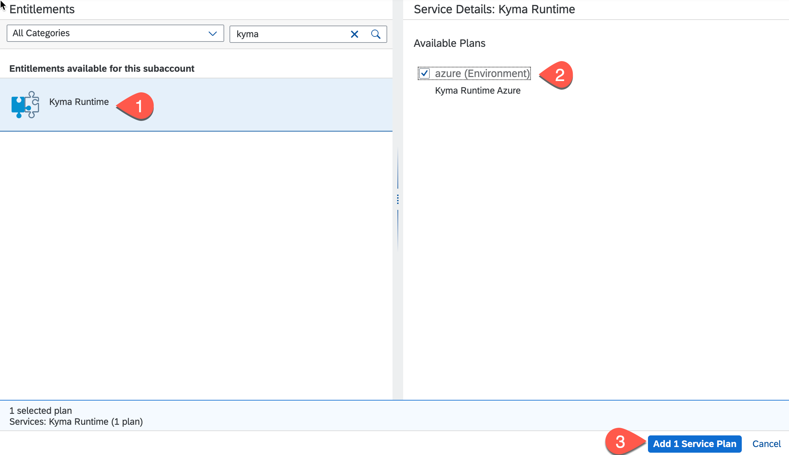

   5. Choose **Add 2 Service Plans**.

   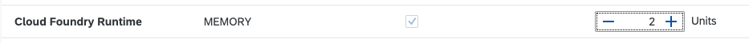

   6. Choose **Save**.

4. Enable the Cloud Foundry environment:

   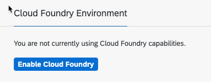

   1. In the **Plan** field, select **standard**.
   2. Choose **Create**.

   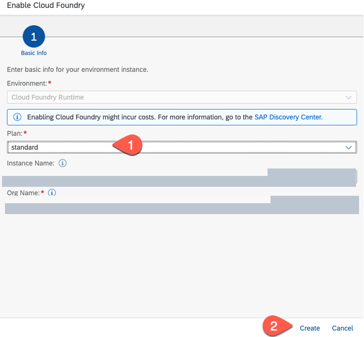

4. Enable the Kyma environment:

   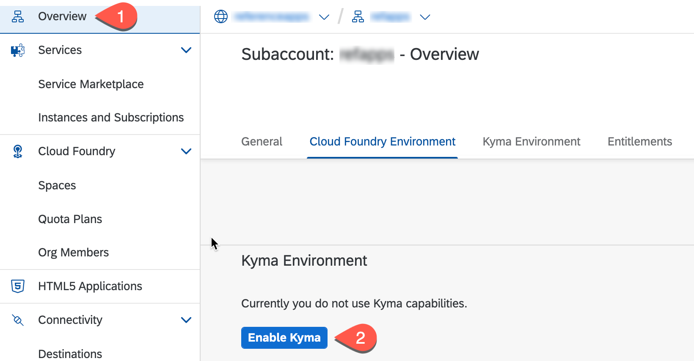

   1. In the **Plan** field, select **standard**.
   2. Choose **Create**.

   

6. Create a space in the Cloud Foundry environment.

   1. Go to the **Overview** section in SAP BTP cockpit, and add a Space to the Cloud Foundry environment.

   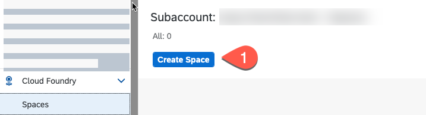

   2. Fill in the **Space Name** field and assign the **Space Manager** and **Space Developer** roles to your user.

   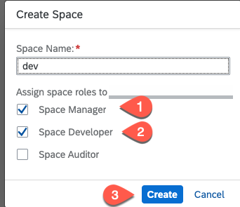

7. To add additional users to the subaccount, choose **Security** > **Users** and choose **Create**.

   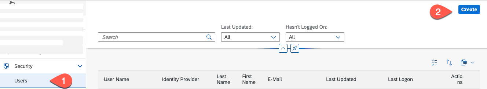

8. In the **User Name** field, enter the user ID in the selected identity provider.

   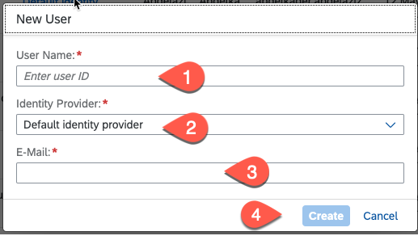

8. Assign the relevant subaccount roles to the users.

      1. Choose **Security** &rarr; **Role Collections**. Select one of the role collections below:

   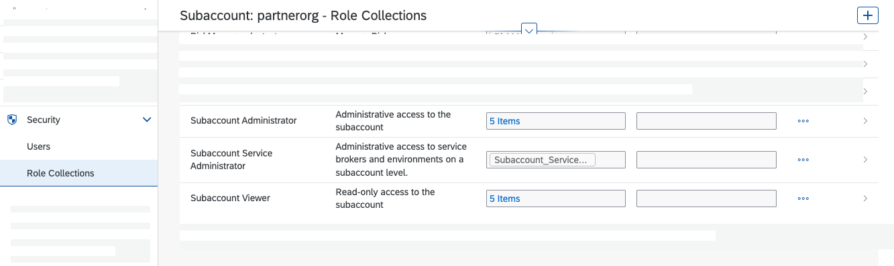

      2. Choose **Edit** and then add a user by setting the User ID. Selecting the relevant Identity Provider and set the user e-mail. Choose **Save**.

   

9.  Add users to the space.

   1. Select **Cloud Foundry** &rarr; **Space** and choose your space. Then, choose **Members**, add the emails of the team members, and assign the necessary roles to them.

   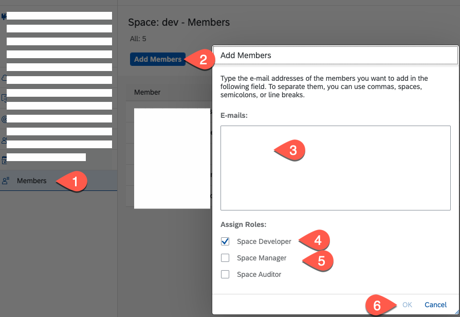

