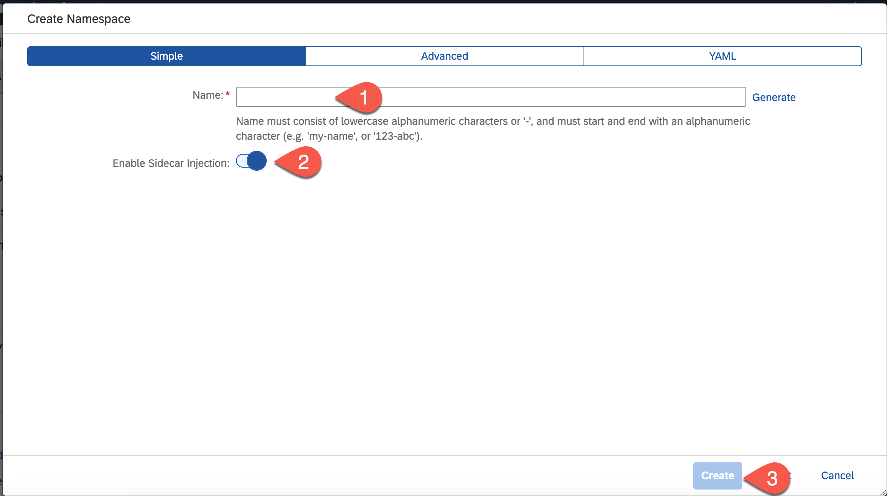

# Configure Command Line Tool *kubectl*

The **kubectl** command line tool lets you control your clusters. You will use it to deploy the application artifacts. But first, you need to provide the details of the cluster.

1. Open the SAP BTP Cockpit and navigate to the overview page of your subaccount, where Kyma is enabled. There you will find the URL to download the kubeconfig file.

   

2. See section [Organizing Cluster Access Using kubeconfig Files](https://kubernetes.io/docs/concepts/configuration/organize-cluster-access-kubeconfig/) in the Kubernetes documentation for more details about the kubeconfig file.

   One option is to configure the file access using the environment variable:

   ```shell
   # assuming the kubeconfig file name is kubeconfig.yaml
   export KUBECONFIG=kubeconfig.yaml
   ```

3. Using the following command you can recheck if your configuration was successful:

   ```
   kubectl config view
   ```

> Note: Make sure that you have installed the Kubernetes OpenID Connect (OIDC) authentication plugin in order to use the command line tool.

4. Create a namespace:
Either you can create the namespaces using kubectl or using the Kyma dashboard.

Here are the steps using kubectl. Open a shell and run:

   ```shell
   kubectl create namespace <YOUR_NAMESPACE_NAME>
   kubectl label namespace <YOUR_NAMESPACE_NAME> istio-injection=enabled
   ```

Here are the steps using the Kyma Dashboard:

1. Open the Kyma Dashboard and choose **Add new namespace** Provide the namespace name, **Enable Sidecar Injection** and choose **Create**.

   
